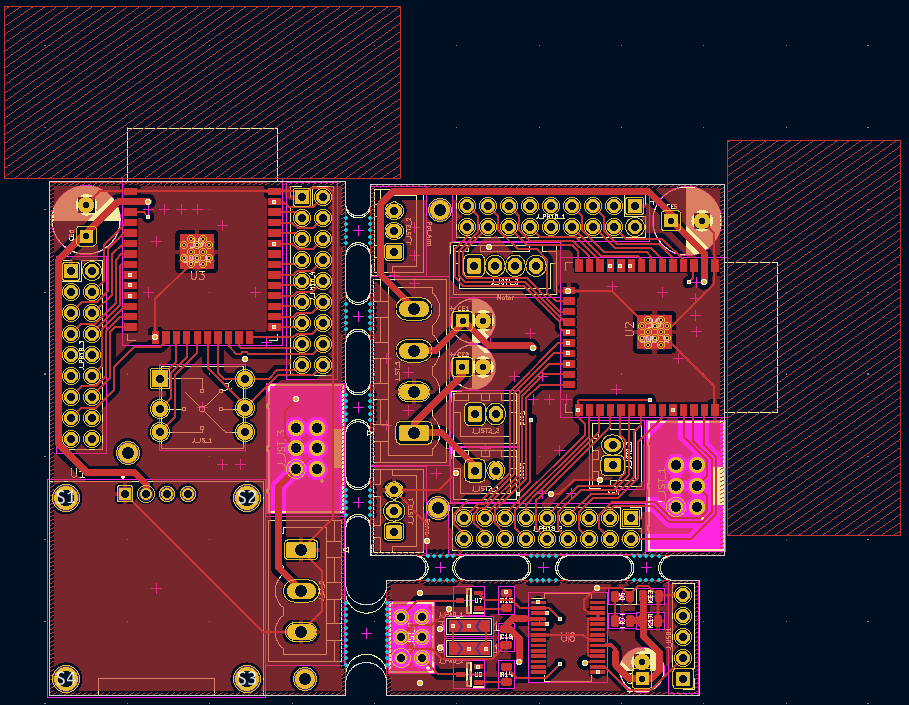
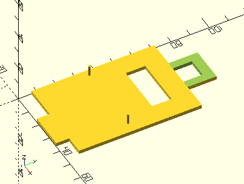

The goal of this project is to make a card shooter that can be remotely controlled.
# Brainstorm
The card shooter consists of 2 components: Remote & Module


The following ideas can be implemented in the project:
- **Screen:**
  Shows the modules current configuration *(which mode and the amount of cards left in the tray)*.
- **Card motor:**
  Will spin and touch the cards for a moment to shoot them out.
- **Horizontal rotation motor:**
  Lets the module shoot in 360°.
- **Vertical rotation servo:**
  Lets the user aim the cards.
- **Solenoid:**
  Presses the card motor on the cards, for just a moment, to shoot them.
- **Bluetooth module:**
  Bluetooth is a rather simple protocol to implement. Via Bluetooth the remote can communicate with the module.
- **Joystick:**
  Set the mode of the module and determine the angle and rotation in free shooting mode.
* **Button:**
  Used to select modes and the amount of players.
* **Laser:**
  Shows where the module is aiming at.
* **Sensor:**
  Reads how many cards are left.
# Research
This research will help build the electrical schematics and eventually the PCB.
## Module
### MCU & Bluetooth
The module will use the **ESP32-WROOM** chip since it has built-in Bluetooth support.
**Specifications**:
- **Voltage:** 3V3
- **Current:** *Needs to be measured*


### Card motor
The card motor will be a brush motor.
- We will mount a wheel, with a rubber band, to shoot the cards
- The motor will spin preemptively to increase the speed when touching the cards.
- When the motor is spinning the servo, with use of an arm, will lower the motor so it touches the cards. Afterwards it will pull the motor back up.
**Specifications**:
- **Voltage:** 3V3/5V.
- **Current:** *Needs to be measured*
- **Control:** H-Brug & GPIO
### Horizontal rotation motor
For the horizontal rotation the NEMA17 stepper motor is used. With this the direction of the module can be set.
**Specifications**:
- **Voltage:** 3V6
- **Current:** 2A
- **Control:** H-Bridge & Pulses
- **Maximum weight:** 5kg/1cm


### Vertical rotation servo
This servo will be used to shoot at a certain angle.
**Specifications**:
- **Voltage:** 5V.
- **Current:** *Needs to be measured*
- **Control:** H-Bridge & Pulses


### Solenoid
The solnoid will push the motor so that the wheel touches against the cards when needed.
**Specifications**:
- **Voltage:** 6V.
- **Current:** *Needs to be measured*
- **Control:** H-Bridge & Pulses
### Laser
Since the cards shoot in an arc, the laser would be inaccurate. Therefore it is left out.
### Sensor
The sensor will be a potentiometer with a 3D printer arm. Depending on the voltage of the middle terminal, the amount of cards can be read.
**Specifications**:
- **Voltage:** 3V3.
- **Current:** *Needs to be measured*
- **Control:** Readings via ADC.
## Remote
**Due to time restrictions the remote is not implemented it can be replaced using the Bluetooth on a phone.**
### MCU & Bluetooth
The remote will use the same chip as the module, the ESP32-WROOM chip.
### Screen
For a screen an OLED will be used, more specifically the SSD1306. This will show the current configuration of the module. One of the settings it the state of the module:
- **Blackjack:** 1 dealer & 4 players
- **Uno:** 4 players *(evenly spaced)*
- **Free mode:** 4 players *(randomly spaced)*
- **Assault mode:** Aim and shoot
**Specifications**:
- **Voltage:** 3V3.
- **Current:**  *Needs to be measured*
- **Control:** I2C


### Joystick
For a Joystick will be a SKQUCAA010.
**Specifications**:
- **Voltage:** 3V3.
- **Control:** Read via GPIO


### Buttons
***This aspect will be left out since the control can be done using the joystick***
# Electrical  schematic
The electrical schematic was made using KiCad.
Most of the external components, except for the servo, wil be connected to the PCB via JST-connectors. Any components fount in the following list should be used, else they should be ordered via the following websites:
- [Farnell](https://be.farnell.com/en-BE/)
- [OctoParts](https://octopart.com/)
- [AliExpress](https://nl.aliexpress.com)


## Full schematic
![[schematic.pdf]]
## Components
### Microcontroller
As previously mentioned, the ESP32-WROOM will be used as microcontroller. It will be placed without dev-board to minimize the PCB surface, since the horizontal motor will lose torque the bigger the rotated surface becomes.
This means that we'll have to make a removable programmer.
The PCB schematic is based on the schematic in of the dev-board datasheets:


Two groups of connectors will be provided:
- **02x03 connector:** The programmer will be connected via these pins.
- **Two 02x09 connectors:** With this all the pins of the ESP32 MCU will be brought to the outside. This is done for debugging purpuses.
The schematic looks as follows:
- Module:


- Remote:


### Programmer
As previously mentioned, there will be a removable programmer to save out space on the PCB. The programmer will make use of a FT232R USB to UART converter.
Specifications:
- **Input USB voltage:** 5V
- **Output UART voltage:** 1V8, 2V8, 3V3 & 5V
The schematic of the PCB is based on two examples:
- Het FT232R "*USB to MCU UART interface*" example:


- The ESP32 Devkit schematic:


As shown in the Devkit schematic *(on the bottom left)*, the programmer makes use of two NPN-transistors to communicate with the MCU. For these transistors the BCW71 will be used.
Specifications:
- **Open collector voltage:** 5V
- **Collector current:** 100mA


The schematic looks as follows:


To make sure the MCU can be programmed the following steps where taken:
- The UART TX & RX pins are connected to *"traingular solder jumper pads"* in case the connections are wrong.
- All pins of the MCU are brought to the outside in case the programmer doesn't work, and there is need of programming via an external devboard *(like the [ESP32 D1 MINI](https://galopago.github.io/assets/pdf/esp32-d1-mini.pdf))*
### Card H-bridge
Since both the card motor and the solenoid make use of coils, they can best be protected using a H-bridge. The H-bridge used is the DRV8833.
Specifications:
- **Maximum voltage:** 10V
- **Maximum current:** 1.5A
Since the driver contains two H-bridges, both the motor and solenoid can be controlled using the same driver.
- The motor functions at 3V.
- The solenoid functions at 6V.
A separate source of 6V will be provided for this driver. *(The motor also functions at 6V)*


The schematic looks as follows:


### Horizontal rotation H-bridge
Two H-bridges are needed to control the NEMA17 *(stepper)* motor. Since the motor functions at 3V, the DRV8833 driver is applicable.
The schematic looks as follows:


### Laser controller
To aim the module a [laser](https://nl.aliexpress.com/item/1005005965904497.html?spm=a2g0o.productlist.main.1.486f5a5fnkwrmv&algo_pvid=1d03160c-83f5-4386-951f-2b8b5557513d&algo_exp_id=1d03160c-83f5-4386-951f-2b8b5557513d-0&pdp_npi=4%40dis%21EUR%213.06%213.06%21%21%2123.17%2123.17%21%4021038e8317283929845612749e1452%2112000035084960358%21sea%21BE%214336790662%21X&curPageLogUid=0sLpbIOsMe3v&utparam-url=scene%3Asearch%7Cquery_from%3A) is used. This one works at 5V. This means we'll have to connect this to the 6V source connected to the card H-bridge.

Since the ESP32 MCU works on 3V3, we'll need a MOSFET to controll the laser. For this the 2N7002 N-channel MOSFET will suffice.
Specifications:
- **Gate threshold voltage:** 2V1
- **Maximum drain current:** 115mA


The schematic looks as follows:


### Potentiometer arm
For a sensor we'll make use of a potentiometer that, with a 3D printed arm, will measure how many cards are left. This will be a 10 kOhm resistor.
To ensure there is no shorting we'll place two resistors *(of about 1kOhm)* between the potentiometer and both the source and the ground.
The schematic looks as follows:


### Vertical rotation servo
The servo needs 5V to function and works on the basis of a pulse signal. For this we'll connect it to the 6V source.
The schematic looks as follows:

![[servo_vert.png]]
### Joystick
The joystick works on the basis of a common pin that gets connected to a UP, DOWN, LEFT, RIGHT or CENTER pin. This common pin will be connected to the 3V3 source using a pull-up resistor. The other pins will be [read via an interrupt](https://lastminuteengineers.com/handling-esp32-gpio-interrupts-tutorial/) on the ESP32.


The schematic looks as follows:


### Menu screen
The menu screen is a SSD1306 OLED screen.
Specifications:
- **Voltage:** 3V3
- **Communication protocol:** I2C


The schematic looks as follows:


### Source
Both the remote and the module need a source, for this we'll use 18650 lithium-ion batteries in combination with step-up and step-down converters.
Included with each battery is a micro-USB charger board that has 5V output pads.
Specifications:
- **Batterij:** 18650 
	- **Average voltage:** 3V6
	- **Capacity:** 1200mAh

- **Step down converter:** LM2596
	- **Input voltage:** 4V - 40V
	- **Output voltage:** 1V23 - 35V


- **Step up converter:** MT3608
	- **Input voltage:** 2V - 24V
	- **Output voltage:** 2V - 28V


The module needs three operating voltages: 3V3, 3V3 motor control & 6V motor control
- **6V MC:** Can be achieved using the step-up converter.
- **3V3 & 3V3 MC:** Can be achieved using the step-down converter.
All three operating voltages will be connected to the PCB via a screw terminal.
The schematic looks as follows:


The remote will only need a single source of 3V3. this can be done with a single battery and a step-down converter.
The schematic looks as follows:


# PCB
The PCB was made using KiCad and ordered at [JLCPCB](https://jlcpcb.com/). it consists out of three parts:
- The module
- The remote
- The programmer
Footprints that aren't included in KiCads base installation are found on [SnapMagic](https://www.snapeda.com/home/) or made via the footprint editor *(these can be found in [/libraries](https://github.com/ThomasKramp/kaarten_shieter/tree/main/libraries) folder)*.
## Routes
### All routes

### Front side routes

### Back side routes

## 3D
### 3D front side

### 3D back side

## Assembly
### Module front side

### Module back side

### Programmer front side

### Programmer back side

### Remote front side

### Remote back side

# Casing
## 3D-printer
The casing is made using OpenSCAD. The files can be found inthe *[/casing](https://github.com/ThomasKramp/kaarten_shieter/tree/main/casing)* directory.
Only a casing for the module was made due to time constraints.


``` C
$fn = 63;
error = 0.25;
error_offset = [error/2,error/2,0];
plate_h = 2;
wall = 2;
card_deck_h = 25; // 18.9 --> 0.3 per card + marging
show_components = false;
show_plates = false;

// Center function
function cntr(x1,x2) = (x1+x2)/2;

//edge_corner_box([10,20,15], 5);
//round_corner_box([10,20,15], 5);

// Corner cutout modules
module edge_corner_box(dimesnions, corner) {
    x = dimesnions[0];
    y = dimesnions[1];
    z = dimesnions[2];
    difference() {
        // Base cube
        cube(dimesnions);
        
        // Corner rounding
        corner_xy = 5-error;
            // Right
        corner_1_offset = [0,0,0];
        translate(corner_1_offset) rotate(0, [0,0,1])
        corner_edge_cut(corner,corner,z);
        corner_2_offset = [0,y,0];
        translate(corner_2_offset) rotate(270, [0,0,1])
        corner_edge_cut(corner,corner,z);
            // Left
        corner_3_offset = [x,0,0];
        translate(corner_3_offset) rotate(90, [0,0,1])
        corner_edge_cut(corner,corner,z);
        corner_4_offset = [x,y,0];
        translate(corner_4_offset) rotate(180, [0,0,1])
        corner_edge_cut(corner,corner,z);
    }
}
module round_corner_box(dimesnions, rounding) {
    x = dimesnions[0];
    y = dimesnions[1];
    z = dimesnions[2];
    difference() {
        // Base cube
        cube(dimesnions);
        
        // Side corner rounding
            // x = 0, y = 0
        corner_1_offset = [0,0,0];
        translate(corner_1_offset) rotate(0, [0,0,1])
        corner_round_cut(rounding, z);
            // x = 0, y = ?
        corner_2_offset = [x,0,0];
        translate(corner_2_offset) rotate(90, [0,0,1])
        corner_round_cut(rounding, z);
            // x = ?, y = 0
        corner_3_offset = [0,y,0];
        translate(corner_3_offset) rotate(270, [0,0,1])
        corner_round_cut(rounding, z);
            // x = ?, y = ?
        corner_4_offset = [x,y,0];
        translate(corner_4_offset) rotate(180, [0,0,1])
        corner_round_cut(rounding, z);
    }
}
module corner_edge_cut(x,y,z) {
    translate([0,y,0]) rotate(270, [0, 0, 1]) difference(){
        //creating a cube
        cube([x, y, z]);
        //rotating the cube
        rotate(45, [0, 0, 1]) cube([2*x, 2*y, z]);
    }
}
module corner_round_cut(length, height) {
    difference() {
        // Main body
        cube([length,length,height]);
        translate([length,length,0]) cylinder(d=length*2,h=height);
    }
}
```

``` C
include <0_settings.scad>
include <6_lid.scad>
include <3_box.scad>

box(show_components);
translate([0,0,case_z]) lid(show_components);
```
### PCB plate
The PCB plate will hold the PCB and be place in the third level of the box.



``` C
include <0_settings.scad>

// PCB
pcb_x = 45.5+error; pcb_y = 43.5+error; pcb_z = 15+error;
pcb_offset = [0,6.5,0]+error_offset;
// Antenna
ant_x = 18.5+error; ant_y = 6.5+error; ant_z = pcb_z;
ant_offset = [17.5,0,0]+error_offset;
// Mounting holes
hole_d = 1.5-error; hole_h = pcb_z;
hole_1_offset = [3.1,pcb_y-8.4,0]+error_offset;
hole_2_offset = [pcb_x-5.8,pcb_y-8.2,0]+error_offset;
// Charger
charger_x = 18+error; charger_y = 20+error; charger_z = 5+error;
// Port
port_x = 9+error; port_y = 2+error; port_z = 3+error;
// Cable hole
holder_xy = 10+error;

// Full dimensions
pcb_plate_x = max(pcb_x,ant_x,charger_x);
pcb_plate_y = pcb_y+ant_y+charger_y+1.5*holder_xy;
pcb_plate_z = max(pcb_z,ant_z,charger_z);

//pcb_plate(show_components);

module pcb_plate(show_pcb=false) {
    // PCB
    pcb_offset = [0,ant_y,0]+error_offset;
    translate(pcb_offset) cube([pcb_x,pcb_y,plate_h]);
    // Antenna
    ant_offset = [17.5,0,0]+error_offset;
    translate(ant_offset) cube([ant_x,ant_y,plate_h]);
    // Mounting holes
    translate(hole_1_offset) cylinder(d=hole_d, h=hole_h/2);
    translate(hole_2_offset) cylinder(d=hole_d, h=hole_h/2);
    // Cable hole
    holder_1_offset = [0,pcb_y+ant_y,0]+error_offset;
    translate(holder_1_offset) cube([holder_xy,holder_xy,plate_h]);
    holder_2_offset = [pcb_x-holder_xy,pcb_y+ant_y,0]+error_offset;
    translate(holder_2_offset) cube([holder_xy,holder_xy,plate_h]);
    holder_3_offset = [0,pcb_y+ant_y+holder_xy,0]+error_offset;
    translate(holder_3_offset) cube([pcb_x,holder_xy,plate_h]);
    // Charger
    charger_offset = [(pcb_x-charger_x)/2,pcb_y+ant_y+1.5*holder_xy,0]+error_offset;
    translate(charger_offset) difference() {
        cube([charger_x, charger_y, plate_h]);
        translate([0,0,plate_h]) charger();
    }
    if (show_pcb) {
        pcb();
        translate(charger_offset+[0,0,plate_h]) charger();
    }
}

module pcb() {
    difference() {
        union() {
            // PCB
            translate(pcb_offset) cube([pcb_x,pcb_y,pcb_z]);
            // Antenna
            translate(ant_offset) cube([ant_x,ant_y,ant_z]);
        }
        // Mounting holes
        translate(hole_1_offset) cylinder(d=hole_d, h=hole_h);
        translate(hole_2_offset) cylinder(d=hole_d, h=hole_h);
    }
}
module charger() {
    // PCB
    cube([charger_x, charger_y, charger_z]);
    // Port
    port_offset = [(charger_x-port_x)/2,charger_y,(charger_z-port_z)/2];
    translate(port_offset) cube([port_x, port_y, port_z]);
    // Connectors
    conn_xy = 10+error; conn_z=plate_h+error;
    conn_offset = [(charger_x-conn_xy)/2,(charger_y-conn_xy)/2,-conn_z];
    translate(conn_offset) cube([conn_xy,conn_xy,conn_z]);
}
```
### Converter plate
The converter plate will hold one step-up and two step-down converters. It will be placed on the second level of the box.


``` C
include <0_settings.scad>

// Step up converter
suc_x = 36+error; suc_y = 17+error; suc_z = 19+error;
// Step down converter
sdc_x = 43.5+error; sdc_y = 21+error; sdc_z = 14+error;
// Converter cables
cc_x = 4+error; cc_y = 3+error;

// Full dimensions
conv_plate_x = max(suc_x,sdc_x)+2*cc_x;
conv_plate_y = suc_y+2*sdc_y+2*wall;
conv_plate_z = max(suc_z,sdc_z);

//conv_plate(show_components);

module conv_plate(show_conv=false) {
    plate_x = sdc_x+2*cc_x; plate_y = suc_y+2*sdc_y+2*wall;
    suc_offset = [(sdc_x-suc_x)/2,0,plate_h];
    sdc_1_offset = [0,suc_y+wall,plate_h];
    sdc_2_offset = [0,suc_y+sdc_y+2*wall,plate_h];
    difference() {
        // Plate
        cube([plate_x,plate_y,plate_h*2]);
        // Step up converter
        translate(suc_offset) step_up_converter();
        // Step down converter
        translate(sdc_1_offset) step_down_converter();
        translate(sdc_2_offset) step_down_converter();
    }
    if (show_conv) {
        translate(suc_offset) step_up_converter();
        translate(sdc_1_offset) step_down_converter();
        translate(sdc_2_offset) step_down_converter();
    }
}

module step_up_converter() {
    // Step up converter
    translate([cc_x,0,0]) cube([suc_x,suc_y,suc_z]);
    // Cables
        // Right
    cable_1_offset = [0,0,0];
    translate(cable_1_offset) cube([cc_x,cc_y,suc_z]);
    cable_2_offset = [0,suc_y-cc_y,0];
    translate(cable_2_offset) cube([cc_x,cc_y,suc_z]);
        // Left
    cable_3_offset = [suc_x+cc_x,0,0];
    translate(cable_3_offset) cube([cc_x,cc_y,suc_z]);
    cable_4_offset = [suc_x+cc_x,suc_y-cc_y,0];
    translate(cable_4_offset) cube([cc_x,cc_y,suc_z]);
}
module step_down_converter() {
    translate([cc_x,0,0]) difference() {
        // Step down converter
        cube([sdc_x,sdc_y,sdc_z]);
    
        // Mounting holes
        hole_d = 3.5-error; hole_h = sdc_z;
        hole_1_offset = [sdc_x-6.5,2.5,0]+error_offset;
        hole_2_offset = [6.5,sdc_y-2.5,0]+error_offset;
        translate(hole_1_offset) cylinder(d=hole_d,h=hole_h);
        translate(hole_2_offset) cylinder(d=hole_d,h=hole_h);
    }
    // Cables
        // Right
    cable_1_offset = [0,0,0];
    translate(cable_1_offset) cube([cc_x,cc_y,sdc_z]);
    cable_2_offset = [0,sdc_y-cc_y,0];
    translate(cable_2_offset) cube([cc_x,cc_y,sdc_z]);
        // Left
    cable_3_offset = [sdc_x+cc_x,0,0];
    translate(cable_3_offset) cube([cc_x,cc_y,sdc_z]);
    cable_4_offset = [sdc_x+cc_x,sdc_y-cc_y,0];
    translate(cable_4_offset) cube([cc_x,cc_y,sdc_z]);
}
```
### Box
The box will consist of three levels to more easily assemble the entire project. Each level will contain certain components:
1) Holds batteries and the horizontal motor
2) Holds the converters and needs to have an opening for the batteries
3) Holds the PCB


``` C
include <0_settings.scad>
include <1_pcb.scad>
include <2_converter.scad>

// Motor
motor_xy = 43+3*error; motor_z = 48+3*error;
cable_x = 16+3*error; cable_y = 12+3*error; cable_z = 9+3*error;
// Battery
bat_xy = 18+3*error; bat_z = 65+3*error;

// Full dimensions add up
    // The width at the motor cable
mc_level_x = cable_x+2*bat_xy+4*wall;
    // The length at the converter plate
conv_level_y = conv_plate_y+bat_xy+wall;

// Casing outer dimensions
case_x = max(pcb_plate_x,conv_plate_x,mc_level_x)+2*wall;
case_y = max(pcb_plate_y,conv_level_y)+2*wall;
case_l1_z = motor_z+wall;
case_l2_z = conv_plate_z+2*wall+error;
case_l3_z = pcb_plate_z+5*wall+error;
case_z = case_l1_z+case_l2_z+case_l3_z;
conrer_rounding = 10;

// Offsets
motor_offset = [(case_x-motor_xy)/2,(case_y-motor_xy)/2,motor_z+wall];
bat_shift = bat_xy+wall;
bat_1_off = [wall, case_y-bat_shift, 2*wall];
bat_2_off = [case_x-bat_shift, case_y-bat_shift, 2*wall];
conv_offset = [(case_x-conv_plate_x)/2,2*wall,wall]+error_offset;
pcbp_offset=[(case_x-pcb_plate_x)/2,wall,wall]+error_offset;


// Case level connector
clc_x = 3; clc_y = 40; clc_z = 5;
clc_1_offset = [wall, (case_y-clc_y)/2,0];
clc_2_offset = [case_x-clc_x-wall, (case_y-clc_y)/2,0];

//box_level_1(show_components);  // Motor
//box_level_2(show_components);  // Converters
//box_level_3(show_components);  // PCB

// Model
module box(show_comp) {
    box_level_1(show_components);  // Motor
    box_level_2(show_components);  // Converters
    box_level_3(show_components);  // PCB
}
module box_level_1(show_comp) {
    // Showcase
    if (show_comp) {
        translate(motor_offset) mirror([0,0,1]) motor();
        translate(bat_1_off) battery_body();
        translate(bat_2_off) battery_body();
    }
    // Cut-out
    difference() {
        round_corner_box([case_x,case_y,case_l1_z], conrer_rounding);
        
        // Bottom corner rounding
        corner_1_offset = [0,0,0];
        translate([0,0,0]) rotate([90,0,90])
        corner_round_cut(conrer_rounding, case_x);
        translate([0,0,0]) rotate([0,270,270])
        corner_round_cut(conrer_rounding, case_y);
        
        corner_2_offset = [0,case_y,0];
        translate(corner_2_offset) rotate([0,270,180])
        corner_round_cut(conrer_rounding, case_x);
        corner_3_offset = [case_x,0,0];
        translate(corner_3_offset) rotate([90,0,180])
        corner_round_cut(conrer_rounding, case_y);
        
        // Motor enclosure
        translate(motor_offset) mirror([0,0,1]) motor();
        
        // Battery enclosure
        translate(bat_1_off) battery_body();
        translate(bat_2_off) battery_body();
    }
    
    // Level connectors
    translate(clc_1_offset+error_offset+[0,0,case_l1_z])
    cube([clc_x-error,clc_y-error,clc_z-error]);
    translate(clc_2_offset+error_offset+[0,0,case_l1_z])
    cube([clc_x-error,clc_y-error,clc_z-error]);
}
module box_level_2(show_comp) {
    // Offsets
    level_2_offset = [0,0,case_l1_z];
    // Showcase
    if (show_plates) {
        translate(conv_offset+level_2_offset) conv_plate(show_comp);
    }
    // Cut-out
    translate(level_2_offset) difference() {
        round_corner_box([case_x,case_y,case_l2_z], conrer_rounding);
        
        // Converter enclosure
        translate(conv_offset) cube([conv_plate_x+error,conv_plate_y+error,case_l2_z+error]);
        
        // Cut-out
        translate(conv_offset+[0,conv_plate_y-error,0]) cube([conv_plate_x+error, bat_xy/2,case_l2_z+error]);
        
        // Level connectors
        translate(clc_1_offset)
        cube([clc_x+error,clc_y+error,clc_z+error]);
        translate(clc_2_offset)
        cube([clc_x+error,clc_y+error,clc_z+error]);
        
        // Previous enclosures
            //Motor
        motor_offset = [(case_x-motor_xy)/2,(case_y-motor_xy)/2,0];
        translate(motor_offset) motor();
        cable_offset = [(motor_xy-cable_x)/2,motor_xy,0];
    translate(motor_offset+cable_offset) cube([cable_x,cable_y,case_l2_z]);
            // Battery
        bat_shift = bat_xy+wall;
        translate([wall, case_y-bat_shift, 0]) battery_body();
        translate([case_x-bat_shift, case_y-bat_shift, 0]) battery_body();
    }
    
    // Level connectors
    translate(clc_1_offset+error_offset+level_2_offset+[0,0,case_l2_z])
    cube([clc_x-error,clc_y-error,clc_z-error]);
    translate(clc_2_offset+error_offset+level_2_offset+[0,0,case_l2_z])
    cube([clc_x-error,clc_y-error,clc_z-error]);
}
module box_level_3(show_comp) {
    // Offsets
    level_3_offset = [0,0,case_l1_z+case_l2_z];
    
    // Showcase
    if (show_plates) {
        translate(pcbp_offset+level_3_offset) pcb_plate(show_comp);
    }
    // Cut-out
    translate(level_3_offset) difference() {
        round_corner_box([case_x,case_y,case_l3_z], conrer_rounding);
        
        // PCB enclosure
        translate(pcbp_offset) cube([pcb_plate_x+error,pcb_plate_y+error,case_l3_z+error]);
        // Port opening
        translate([(case_x-port_x)/2,case_y-wall,2.5*wall]+error_offset) cube([port_x+error,port_y+wall+error,port_z]);
        
        // Cable opening
        cable_y = 12; cable_z = 7;
        translate([0,case_y/1.75,pcb_z/2]) cube([case_x, cable_y, cable_z]);
        
        // Level connectors
        translate(clc_1_offset)
        cube([clc_x+error,clc_y+error,clc_z+error]);
        translate(clc_2_offset)
        cube([clc_x+error,clc_y+error,clc_z+error]);
        
        // Previous enclosures
            //Motor
        motor_offset = [(case_x-motor_xy)/2,(case_y-motor_xy)/2,0];
        translate(motor_offset) motor();
    cable_offset = [(motor_xy-cable_x)/2,motor_xy,0];
    translate(motor_offset+cable_offset) cube([cable_x,cable_y,case_l3_z]);
            // Battery
        bat_shift = bat_xy+wall;
        translate([wall, case_y-bat_shift, 0]) battery_body();
        translate([case_x-bat_shift, case_y-bat_shift, 0]) battery_body();
            // Converter
        translate(conv_offset+[0,0,-wall]) cube([conv_plate_x+error,conv_plate_y+error,case_l3_z+wall+error]);
            // Cut-out
        translate(conv_offset+[0,conv_plate_y-error,-wall]) cube([conv_plate_x+error, bat_xy/2,case_l3_z+wall+error]);
    }
}

module battery_body() {
    // Battery
    translate([bat_xy/2,bat_xy/2,0]) cylinder(d=bat_xy,h=bat_z);
}
module motor() {
    // Corner rounding
    corner_xy = 5-error;
    // Main body
    edge_corner_box([motor_xy,motor_xy,motor_z],corner_xy);
    
    // Cable extensions
    cable_offset = [(motor_xy-cable_x)/2,motor_xy,0];
    translate(cable_offset) cube([cable_x,cable_y,cable_z]);
    
    // Rotary plate
    rp_d = 22+error; rp_h = wall;
    rp_offset = [motor_xy/2,motor_xy/2,motor_z];
    translate(rp_offset) cylinder(d=rp_d,h=rp_h);
    
    // Motor screw holes
    screw_xy = 3+error; screw_h = wall;
    sh_edge_shift = 6+3*error;
            // Right
    screw_1_offset = [sh_edge_shift,sh_edge_shift,motor_z];
    translate(screw_1_offset) cylinder(d=screw_xy,h=screw_h);
    screw_2_offset = [sh_edge_shift,motor_xy-sh_edge_shift,motor_z];
    translate(screw_2_offset) cylinder(d=screw_xy,h=screw_h);
            // Left
    screw_3_offset = [motor_xy-sh_edge_shift,sh_edge_shift,motor_z];
    translate(screw_3_offset) cylinder(d=screw_xy,h=screw_h);
    screw_4_offset = [motor_xy-sh_edge_shift,motor_xy-sh_edge_shift,motor_z];
    translate(screw_4_offset) cylinder(d=screw_xy,h=screw_h);
}
```
### Sensor
The sensor contains two parts:
1) A mount to hold the potentiometer in place.
2) An arm that will be mounted on the potentiometer to measure the height of the deck.


``` C
include <0_settings.scad>

// Potentiometer screw
ps_d = 10+error; ps_h = 5+error;
// Potentiometer holder
ph_x = ps_d+2*wall; ph_y = ps_h; ph_z = ph_x+card_deck_h;

//full_sensor();
//pot_holder();
//pot_arm();

module full_sensor() {
    translate([0,ph_x,0]) rotate(270, [0,0,1]) pot_holder();
    translate([-(23+wall+error),0,card_deck_h+wall+ps_d/2]) rotate(315, [1,0,0]) pot_arm();
}
module pot_holder() {
    difference() {
        cube([ph_x, ph_y, ph_z]);
        translate([ph_x/2,ph_y,card_deck_h+ph_x/2]) rotate(90,[1,0,0]) cylinder(h=ps_h,d=ps_d);
        // Lid grooves
        gr_start_y = (ph_y-wall)/2;
            // left
        translate([0, gr_start_y, 0]) cube([wall, wall, card_deck_h]);
            // right
        translate([ph_x-wall, gr_start_y, 0]) cube([wall, wall, card_deck_h]);
            // bottom
        translate([0, 0, 0]) cube([ph_x, gr_start_y+wall, wall]);
    }
}
module pot_arm() {
    // Potentiometer arm
    arm_x = 7; arm_y = 30; arm_z = 7;
    // Weight hole
    wh_d = 5; wh_h = arm_z;
    difference() {
        union() {
            translate([0,5,5]) rotate(90,[0,1,0]) cylinder(h=14, d=10);
            translate([0,5,3]) cube([arm_x,arm_y,arm_z]);
        }
        translate([4,2,2]) pot_rod();
        translate([arm_x/2,arm_y+1,3]) cylinder(h=wh_h,d=wh_d);
        // corner cutout
        translate([0,arm_y+5,3]) rotate(270, [0,0,1]) corner_round_cut(3.78, arm_z);
        translate([arm_x,arm_y+5,3]) rotate(180, [0,0,1]) corner_round_cut(3.78, arm_z);
    }
}
module pot_rod() {
    // Potentiometer rod
    pr_d = 6; pr_h = 10;
    // Potentiometer rod groove
    prg_x = 2; prg_y = 6; prg_z = 1-0.1;
    // Rod
    difference() {
        translate([0,3,3]) rotate(90,[0,1,0]) cylinder(h=pr_h, d=pr_d);
        translate([0,0,2.45]) cube([prg_x,prg_y,prg_z]);
    }
}
```
### Shooter
The shooter consists of three parts:
1) The mount to hold the servo
2) The arm that will hold the card motor *(from which it will be tilted)*
3) The wheel that will be mounted to the axis of the card motor. This has a groove for rubber bands.
***Note that the servo is used for shooting and not the solenoid. This is later explained in the "Faults & corrections" section under implementation."***


``` C
include <0_settings.scad>
include <gear_lib.scad> // https://robotix.ah-oui.org/site/main.php?found=200706-basic-gear-lib


// Card motor
cm_x = 20+2*error; cm_y = 20+2*error; cm_z = 15+2*error;
// Card motor holder
cmh_x = cm_x; cmh_y = cm_y+2*wall; cmh_z = cm_z+2*wall;
holder_off = 6;
// Arm
la_y = 40;  // Long arm length
sa_y = 5;   // Short arm length
arm_xz = 7; arm_y = la_y + sa_y; pivot_full_y = arm_y + arm_xz/2;
arm_full_y = pivot_full_y + cmh_y/2;
// Arm hole
ah_d = arm_xz - wall + error; ah_h = arm_xz;
// Arm reinforcement
ar_d = arm_xz + wall; ar_h = arm_xz;
// Card wheel
wheel_d = cmh_y+error; wheel_h = 10+error;
shaft_d = 9+error; shaft_h = 12+error;

//card_wheel();
//union() {
//    translate([cmh_x,pivot_full_y-cmh_x/2,-(cm_y-cm_z)/2]) card_wheel();
//    cm_arm();
//}
module cm_arm() {
    difference() {
        translate([cm_x-arm_xz,0,0]) cm_pivot();
        translate([0,pivot_full_y-cmh_x/2,0]) translate([0, wall, wall]) card_motor();
    }
    translate([0,pivot_full_y-cmh_x/2,0]) cm_holder();
}
module cm_pivot() {
    translate([0,arm_xz/2,0]) difference() {
        union() {
            // Arm
            cube([arm_xz,arm_y,arm_xz]);
            // Arm roundings
            translate([arm_xz/2,0,0]) cylinder(h=ar_h,d=arm_xz);
            // Arm reinforcement
            translate([0,sa_y,(arm_xz-ar_d)/2]) translate([0,ar_d/2,ar_d/2]) 
            rotate(90,[0,1,0]) cylinder(h=ar_h,d=ar_d);
        }
        translate([0,sa_y,(arm_xz-ar_d)/2]) translate([0,ar_d/2,ar_d/2]) 
        rotate(90,[0,1,0]) cylinder(h=ah_h,d=ah_d);
    }
}

module cm_holder() {
    difference() {
        cube([cmh_x, cmh_y, cmh_z]);
        translate([0, wall, wall]) card_motor();
        difference() {
            translate([0,cm_y/2+wall,cm_y/2-wall/2]) rotate(90, [0,1,0]) cylinder(h=cm_x, d=cmh_y*2);
            translate([0,cm_y/2+wall,cm_y/2-wall/2]) rotate(90, [0,1,0]) cylinder(h=cm_x, d=cmh_y);
        }
    }
}
module card_motor() {
    cm_excess = (cm_y-cm_z)/2;
    translate([0,0,-cm_excess]) difference() {
        translate([0,cm_y/2,cm_y/2]) rotate(90, [0,1,0]) cylinder(h=cm_x, d=cm_y);
        translate([0,0,0]) cube([cm_x,cm_y,cm_excess]);
        translate([0,0,cm_excess+cm_z]) cube([cm_x,cm_y,cm_excess]);
    }
}
module card_wheel() {
    difference () {
        translate([0,wheel_d/2,wheel_d/2]) rotate(90, [0,1,0]) cylinder(h=shaft_h, d=shaft_d);
        translate([0,wheel_d/2,wheel_d/2]) rotate(90, [0,1,0]) gear(8,60,7);
    }
    difference() {
        translate([shaft_h,wheel_d/2,wheel_d/2]) rotate(90, [0,1,0]) cylinder(h=wheel_h, d=wheel_d);
        // Internal wheel
        difference() {
            translate([1.2*shaft_h,wheel_d/2,wheel_d/2]) rotate(90, [0,1,0]) cylinder(h=wheel_h/2, d=wheel_d);
            translate([1.2*shaft_h,wheel_d/2,wheel_d/2]) rotate(90, [0,1,0]) cylinder(h=wheel_h/2, d=wheel_d-2*wall);
        }
    }
}
```

``` C
include <0_settings.scad>
include <gear_lib.scad> // https://robotix.ah-oui.org/site/main.php?found=200706-basic-gear-lib


// Card motor
cm_x = 20+2*error; cm_y = 20+2*error; cm_z = 15+2*error;
// Card motor holder
cmh_x = cm_x; cmh_y = cm_y+2*wall; cmh_z = cm_z+2*wall;
holder_off = 6;
// Arm
la_y = 40;  // Long arm length
sa_y = 5;   // Short arm length
arm_xz = 7; arm_y = la_y + sa_y; pivot_full_y = arm_y + arm_xz/2;
arm_full_y = pivot_full_y + cmh_y/2;
// Arm hole
ah_d = arm_xz - wall + error; ah_h = arm_xz;
// Arm reinforcement
ar_d = arm_xz + wall; ar_h = arm_xz;
// Card wheel
wheel_d = cmh_y+error; wheel_h = 10+error;
shaft_d = 9+error; shaft_h = 12+error;

// Servo
servo_x = 15+error; servo_y = 12.3+error; servo_z = 22.7+error;
// Montering
mont_x = 40+error; mont_y = 16+error; mont_z = 4+error;

// holder();
// card_wheel();
// cm_arm();
// shooter(show_components);
module shooter(show_comp) {
    holder();
    if (show_comp) {
        translate([13,-servo_y/2+wall,servo_z/2+wall]) union() {
            translate([cmh_x+wall*2,pivot_full_y-cmh_x/2,-(cm_y-cm_z)/2]) 
                card_wheel();
            cm_arm();
        }
    }
}

module holder() {
    translate([mont_x,mont_y+error,0]) rotate(180, [0,0,1]) 
        corner_round_cut(mont_y,mont_z+wall);
    translate([mont_x,mont_y*2,0]) rotate(90, [0,0,1]) 
        corner_round_cut(mont_y,mont_z+wall);
    translate([servo_x,mont_y,mont_z+wall]) rotate(270, [0,1,0]) 
        corner_round_cut(mont_y,servo_x);
    translate([0,servo_y+wall*2-error,0]) cube([mont_x,mont_y,mont_z+wall]);
    difference() {
        cube([servo_x,servo_y+wall*2,servo_z+wall*2]);
        translate([0,wall,wall]) cube([servo_x,servo_y,servo_z]);
    }
}

module cm_arm() {
    difference() {
        translate([cm_x-arm_xz,0,0]) cm_pivot();
        translate([0,pivot_full_y-cmh_x/2,0]) translate([0, wall, wall]) card_motor();
    }
    translate([0,pivot_full_y-cmh_x/2,0]) cm_holder();
}
module cm_pivot() {
    translate([0,arm_xz/2,0]) difference() {
        union() {
            // Arm
            cube([arm_xz,arm_y,arm_xz]);
            // Arm roundings
            translate([arm_xz/2,0,0]) cylinder(h=ar_h,d=arm_xz);
            // Arm reinforcement
            translate([0,sa_y,(arm_xz-ar_d)/2]) translate([0,ar_d/2,ar_d/2]) 
            rotate(90,[0,1,0]) cylinder(h=ar_h,d=ar_d);
        }
        translate([0,sa_y,(arm_xz-ar_d)/2]) translate([0,ar_d/2,ar_d/2]) 
        rotate(90,[0,1,0]) cylinder(h=ah_h,d=ah_d);
    }
}

module cm_holder() {
    difference() {
        cube([cmh_x, cmh_y, cmh_z]);
        translate([0, wall, wall]) card_motor();
        difference() {
            translate([0,cm_y/2+wall,cm_y/2-wall/2]) rotate(90, [0,1,0]) cylinder(h=cm_x, d=cmh_y*2);
            translate([0,cm_y/2+wall,cm_y/2-wall/2]) rotate(90, [0,1,0]) cylinder(h=cm_x, d=cmh_y);
        }
    }
}
module card_motor() {
    cm_excess = (cm_y-cm_z)/2;
    translate([0,0,-cm_excess]) difference() {
        translate([0,cm_y/2,cm_y/2]) rotate(90, [0,1,0]) cylinder(h=cm_x, d=cm_y);
        translate([0,0,0]) cube([cm_x,cm_y,cm_excess]);
        translate([0,0,cm_excess+cm_z]) cube([cm_x,cm_y,cm_excess]);
    }
}
module card_wheel() {
    difference () {
        translate([0,wheel_d/2,wheel_d/2]) rotate(90, [0,1,0]) cylinder(h=shaft_h, d=shaft_d);
        translate([0,wheel_d/2,wheel_d/2]) rotate(90, [0,1,0]) gear(8,60,7);
    }
    difference() {
        translate([shaft_h,wheel_d/2,wheel_d/2]) rotate(90, [0,1,0]) cylinder(h=wheel_h, d=wheel_d);
        // Internal wheel
        difference() {
            translate([1.2*shaft_h,wheel_d/2,wheel_d/2]) rotate(90, [0,1,0]) cylinder(h=wheel_h/2, d=wheel_d);
            translate([1.2*shaft_h,wheel_d/2,wheel_d/2]) rotate(90, [0,1,0]) cylinder(h=wheel_h/2, d=wheel_d-2*wall);
        }
    }
}
```
### Lid
The lid is a combination of three parts:
1) The shooter mount
2) The lid mounts *(so it wont fall of the box)*
3) The card holder


``` C
include <0_settings.scad>
include <1_pcb.scad>
include <2_converter.scad>
include <3_box.scad>

//mounts();

module mounts() {
    // Fit in case
        // Battery 1
    difference() {
        battery1();
        battery1(2);    // Battery 1 hole
        cut_out(2);     // Cut-out
        pcb(2);         // Remove PCB square
    }
    // Battery 2
    difference() {
        battery2();
        battery2(2);    // Battery 2 hole
        cut_out(2);     // Cut-out
        pcb(2);         // Remove PCB square
    }
        // Converter
    difference() {
        conv();
        conv(2);        // Converter hole
        cut_out(2);     // Cut-out
        pcb(2);         // Remove PCB square
    }
        // Cut-out
    difference() {
        cut_out();
        cut_out(2);     // Cut-out
        battery1(2);    // Battery 1 hole
        battery2(2);    // Battery 2 hole
        conv(2);        // Converter hole
        pcb(2);         // Remove PCB square
    }
        // PCB
    difference() {
        pcb();
        pcb(2);         // PCB hole
        battery1(2);    // Battery 1 hole
        battery2(2);    // Battery 2 hole
        conv(2);        // Converter hole
        cut_out(2);     // Cut-out
    }
}

module battery1(hole=0) {
    translate([bat_xy/2,bat_xy/2,0])
    translate(bat_1_off-[0,0,2*wall])
    cylinder(d=bat_xy-2*hole-error,h=3*wall);
}
module battery2(hole=0) {
    translate([bat_xy/2,bat_xy/2,0])
    translate(bat_2_off-[0,0,2*wall])
    cylinder(d=bat_xy-2*hole-error,h=3*wall);
}
module conv(hole=0) {
    translate(conv_offset+[hole,hole,-wall]+error_offset)
    cube([conv_plate_x-2*hole-error,conv_plate_y-2*hole-error, 3*wall]);
}
module cut_out(hole=0) {
    translate(conv_offset+[error/2,conv_plate_y-error,0]+[hole,hole,-wall])
    cube([conv_plate_x-2*hole-error,bat_xy/2-2*hole-error,3*wall]);
}
module pcb(hole=0) {
    translate(pcbp_offset+[hole,hole,-wall]+error_offset)
    cube([pcb_plate_x-2*hole-error,pcb_plate_y-2*hole-error,3*wall]);
}
```

``` C
include <0_settings.scad>
include <3_box.scad>
include <4_sensor.scad>
include <5_shooter.scad>
include <6_lid_mount.scad>

// Card size
card_x = 56+error; card_y = 87+error; card_z = card_deck_h;
lid_wall = (case_x-card_x)/2;

// lid(show_components);
    

module lid(show_comp) {
    // Showcase
    if (show_comp) {
        translate([case_x-lid_wall,(case_y-ph_x)/2,0]) full_sensor();
        translate([-mont_x,10,0]) shooter(show_comp);
    }
    translate([-mont_x,10,0]) shooter(false);
    translate([0,0,-3*wall]) mounts();
    difference() {
        union() {
            // Main body
            round_corner_box([case_x,case_y,plate_h+card_z], conrer_rounding);
            // Card tower plate
        }
        // Cards
        card_offset = [lid_wall,-(card_y-case_y+lid_wall),plate_h];
        translate(card_offset) card();
        // Sensor
        translate([case_x-lid_wall,(case_y-ph_x)/2,0]) full_sensor();
        // Sensor weight hole
        translate([(case_x+wall)/2,case_y-10,mont_z*2])
        cube([11,10,card_deck_h]);
        // Shooter hole
        translate([0,case_y*4/9,mont_z*2])
        cube([11,25,card_deck_h]);
    }
}

module card() {
    difference() {
        // Base card
         cube([card_x, card_y, card_z]);
        
        // Corner rounding
        rounding = 3.78;
            // x = 0, y = 0
        translate([0,0,0]) rotate(0, [0,0,0])
        corner_round_cut(rounding, card_z);
            // x = 0, y = ?
        translate([0,card_y,0]) rotate(270, [0,0,1])
        corner_round_cut(rounding, card_z);
            // x = ?, y = 0
        translate([card_x,0,0]) rotate(90, [0,0,1])
        corner_round_cut(rounding, card_z);
            // x = ?, y = ?
        translate([card_x,card_y,0]) rotate(180, [0,0,1])
        corner_round_cut(rounding, card_z);
    }
}
module card_deck() {
    for (i = [0 : 54]) {
        translate([0,0,i*card_h]) card();
    }
}
```
## Lazercutter
Only the base plate will be made using the lasercutter. Three of these base plates will be glued together to make the full base. The files can be found in the *[/laser_cutter](https://github.com/ThomasKramp/kaarten_shieter/tree/main/laser_cutter)*

``` C
$fn = 63;

plate_x = 100; plate_y = 100; plate_z = 2;
kerf = 0.1;
hole_d = 4.9-2*kerf; hole_h = plate_z;
chip_x = 0.5+kerf; chip_y = hole_d; chip_z = hole_h;
kerf = 0.1;


projection() difference() {
    // Plate
    translate([-plate_x/2, -plate_y/2, 0])
    cube([plate_x, plate_y, plate_z]);
    
    // Hole
    difference() {
        cylinder(h=hole_h, d=hole_d);
        translate([hole_d/2-chip_x, -chip_y/2, 0])
        cube([chip_x, chip_y, chip_z]);
    }
}
```


# Implementation
### Arm
Since the ESP32 MCU functions at a voltage of 3V3 en the analogue value can be mapped to [analoge waarde kan mappen op 12 bits (4096)](https://lastminuteengineers.com/esp32-basics-adc/)

Aangezien de ESP32 MCU werkt met een spanning van 3V3 en het een , heeft het een accuraatheid van 805µV.
We nemen een potentiometer van 10kOhm en meten de waarde die over de potentiometer staat.
Voor de veiligheid zijn er een paar serieweerstanden toegevoegd zodat er geen open keten ontstaat. Neem 4 1kOhm weerstanden:
- Als de potentiometer helemaal open staat *(0Ohm)*, dan zal er een voltage van 470mV gemeten worden.
$$V_{IN} = \frac{R_{UP}}{R_{UP} + R_{Pot Open} + R_{Down}} \cdot V_{CC} = \frac{2k\Omega}{2k\Omega + 10k\Omega + 2k\Omega} \cdot 3V3 = 470mV$$
- Als de potentiometer helemaal gelsoten staat *(10kOhm)*, dan zal er een voltage van 2V82 gemeten worden.
$$V_{IN} = \frac{R_{UP} + R_{Pot Open}}{R_{UP} + R_{Pot Open} + R_{Down}} \cdot V_{CC} = \frac{2k\Omega + 10k\Omega}{2k\Omega + 10k\Omega + 2k\Omega} \cdot 3V3 = 2V82$$


==A 10 kOhm potentiometer flanked by two 2 kOhm resistors, leads to a 4 to 14 kOhm resistor. This leads to a current between 236 and 825 µA.==

$I_{low}=\frac{U}{R_{high}}=\frac{3.3}{14*10^3}=0.236\text{mA}$
$I_{high}=\frac{U}{R_{low}}=\frac{3.3}{4*10^3}=0.825\text{mA}$


## Faults & corrections


### Source problems

### Solinoid removal


### Fouten in pin verdeling
Uit verder onderzoek blijk dat [niet alle pinnen op de ESP32 WROOM MCU bruikbaar](https://lastminuteengineers.com/esp32-wroom-32-pinout-reference) zijn.

| Bruikbaar | Pins | Probeer te vermijden | Pins | Onbruikbaar | Pins |
| --------- | ---- | -------------------- | ---- | ----------- | ---- |
| GPIO4     | 26   | GPIO0                | 25   | GPIO1       | 35   |
| GPIO13    | 16   | GPIO2                | 24   | GPIO3       | 34   |
| GPIO14    | 13   | GPIO5                | 29   | GPIO6       | 20   |
| GPIO16    | 27   | GPIO12               | 14   | GPIO7       | 21   |
| GPIO17    | 28   | GPIO15               | 23   | GPIO8       | 22   |
| GPIO18    | 30   | GPIO34 *(Input)*     | 6    | GPIO9       | 17   |
| GPIO19    | 31   | GPIO35 *(Input)*     | 7    | GPIO10      | 18   |
| GPIO21    | 33   | GPIO36 *(Input)*     | 4    | GPIO11      | 19   |
| GPIO22    | 36   | GPIO39 *(Input)*     | 5    | /           |      |
| GPIO23    | 37   | /                    |      | /           |      |
| GPIO25    | 10   | /                    |      | /           |      |
| GPIO26    | 11   | /                    |      | /           |      |
| GPIO27    | 12   | /                    |      | /           |      |
| GPIO32    | 8    | /                    |      | /           |      |
| GPIO33    | 9    | /                    |      | /           |      |
Dit betekent dat de volgende pinnen doorverbonden moeten worden:
- Voor de module:

| Signaal          | Oude Pin      | Nieuwe Pin    |
| ---------------- | ------------- | ------------- |
| EN_Hori          | 17 *(GPIO9)*  | 8 *(GPIO32)*  |
| Motor_Hori_Black | 19 *(GPIO11)* | 9 *(GPIO33)*  |
| Motor_Hori_Green | 20 *(GPIO6)*  | 10 *(GPIO25)* |
| Motor_Hori_Red   | 21 *(GPIO7)*  | 11 *(GPIO26)* |
| Motor_Hori_Blue  | 22 *(GPIO8)*  | 12 *(GPIO27)* |
- Voor de afstandsbediening:

| Signaal   | Oude Pin      | Nieuwe Pin    |
| --------- | ------------- | ------------- |
| UP_JS     | 17 *(GPIO9)*  | 8 *(GPIO32)*  |
| LEFT_JS   | 18 *(GPIO10)* | 9 *(GPIO33)*  |
| DOWN_JS   | 19 *(GPIO11)* | 10 *(GPIO25)* |
| RIGHT_JS  | 20 *(GPIO6)*  | 11 *(GPIO26)* |
| CENTER_JS | 21 *(GPIO7)*  | 12 *(GPIO27)* |

## Code

## Measurements