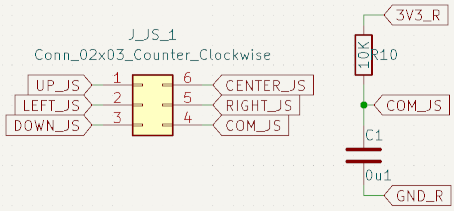
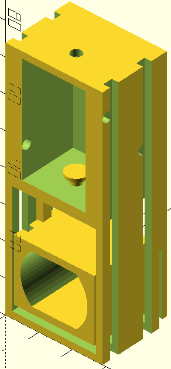

The goal of this project is to make a card shooter that can be remotely controlled.
# Brainstorm
The card shooter consists of 2 components: Remote & Module


The following ideas can be implemented in the project:
- **Screen:**
  Shows the modules current configuration *(which mode and the amount of cards left in the tray)*.
- **Card motor:**
  Will spin and touch the cards for a moment to shoot them out.
- **Horizontal rotation motor:**
  Lets the module shoot in 360°.
- **Vertical rotation servo:**
  Lets the user aim the cards.
- **Solenoid:**
  Presses the card motor on the cards, for just a moment, to shoot them.
- **Bluetooth module:**
  Bluetooth is a rather simple protocol to implement. Via Bluetooth the remote can communicate with the module.
- **Joystick:**
  Set the mode of the module and determine the angle and rotation in free shooting mode.
* **Button:**
  Used to select modes and the amount of players.
* **Laser:**
  Shows where the module is aiming at.
* **Sensor:**
  Reads how many cards are left.
# Research
This research will help build the electrical schematics and eventually the PCB.
## Module
### MCU & Bluetooth
The module will use the **ESP32-WROOM** chip since it has built-in Bluetooth support.
**Specifications**:
- **Voltage:** 3V3
- **Current:** *Needs to be measured*


### Card motor
The card motor will be a brush motor.
- We will mount a wheel, with a rubber band, to shoot the cards
- The motor will spin preemptively to increase the speed when touching the cards.
- When the motor is spinning the servo, with use of an arm, will lower the motor so it touches the cards. Afterwards it will pull the motor back up.
**Specifications**:
- **Voltage:** 3V3/5V.
- **Current:** *Needs to be measured*
- **Control:** H-Brug & GPIO
### Horizontal rotation motor
For the horizontal rotation the NEMA17 stepper motor is used. With this the direction of the module can be set.
**Specifications**:
- **Voltage:** 3V6
- **Max current:** 2A2
- **Control:** H-Bridge & Pulses
- **Stall torque:** 5 kg/cm


### Vertical rotation servo
This servo will be used to shoot at a certain angle.
**Specifications**:
- **Voltage:** 5V.
- **Current:** *Needs to be measured*
- **Control:** H-Bridge & Pulses
- **Stall torque:** 2.2 kg/cm


### Solenoid
The solnoid will push the motor so that the wheel touches against the cards when needed.
**Specifications**:
- **Voltage:** 6V.
- **Current:** *Needs to be measured*
- **Control:** H-Bridge & Pulses
### Laser
Since the cards shoot in an arc, the laser would be inaccurate. Therefore it is left out.
### Sensor
The sensor will be a potentiometer with a 3D printer arm. Depending on the voltage of the middle terminal, the amount of cards can be read.
**Specifications**:
- **Voltage:** 3V3.
- **Max current:** 236 µA *(reasoning can be found under "Potentiometer arm" in the "Electrical schematic" section)*
- **Control:** Readings via ADC.
## Remote
**Due to time restrictions the remote is not implemented it can be replaced using the Bluetooth on a phone.**
### MCU & Bluetooth
The remote will use the same chip as the module, the ESP32-WROOM chip.
### Screen
For a screen an OLED will be used, more specifically the SSD1306. This will show the current configuration of the module. One of the settings it the state of the module:
- **Blackjack:** 1 dealer & 4 players
- **Uno:** 4 players *(evenly spaced)*
- **Free mode:** 4 players *(randomly spaced)*
- **Assault mode:** Aim and shoot
**Specifications**:
- **Voltage:** 3V3.
- **Maximum current:**  15 mA
- **Control:** I2C


### Joystick
For a Joystick will be a SKQUCAA010.
**Specifications**:
- **Voltage:** 3V3.
- **Control:** Read via GPIO


### Buttons
***This aspect will be left out since the control can be done using the joystick***
# Electrical  schematic
The electrical schematic was made using KiCad.
Most of the external components, except for the servo, wil be connected to the PCB via JST-connectors. Any components fount in the following list should be used, else they should be ordered via the following websites:
- [Farnell](https://be.farnell.com/en-BE/)
- [OctoParts](https://octopart.com/)
- [AliExpress](https://nl.aliexpress.com)


## Full schematic
![[schematic.pdf]]
## Components
### Microcontroller
As previously mentioned, the ESP32-WROOM will be used as microcontroller. It will be placed without dev-board to minimize the PCB surface, since the horizontal motor will lose torque the bigger the rotated surface becomes.
This means that we'll have to make a removable programmer.
The PCB schematic is based on the schematic in of the dev-board datasheets:


Two groups of connectors will be provided:
- **02x03 connector:** The programmer will be connected via these pins.
- **Two 02x09 connectors:** With this all the pins of the ESP32 MCU will be brought to the outside. This is done for debugging purpuses.
The schematic looks as follows:
- Module:


- Remote:


### Programmer
As previously mentioned, there will be a removable programmer to save out space on the PCB. The programmer will make use of a FT232R USB to UART converter.
Specifications:
- **Input USB voltage:** 5V
- **Output UART voltage:** 1V8, 2V8, 3V3 & 5V
The schematic of the PCB is based on two examples:
- Het FT232R "*USB to MCU UART interface*" example:


- The ESP32 Devkit schematic:


As shown in the Devkit schematic *(on the bottom left)*, the programmer makes use of two NPN-transistors to communicate with the MCU. For these transistors the BCW71 will be used.
Specifications:
- **Open collector voltage:** 5V
- **Collector current:** 100mA


The schematic looks as follows:


To make sure the MCU can be programmed the following steps where taken:
- The UART TX & RX pins are connected to *"traingular solder jumper pads"* in case the connections are wrong.
- All pins of the MCU are brought to the outside in case the programmer doesn't work, and there is need of programming via an external devboard *(like the [ESP32 D1 MINI](https://galopago.github.io/assets/pdf/esp32-d1-mini.pdf))*
### Card H-bridge
Since both the card motor and the solenoid make use of coils, they can best be protected using a H-bridge. The H-bridge used is the DRV8833.
Specifications:
- **Maximum voltage:** 10V
- **Maximum current:** 1.5A
Since the driver contains two H-bridges, both the motor and solenoid can be controlled using the same driver.
- The motor functions at 3V.
- The solenoid functions at 6V.
A separate source of 6V will be provided for this driver. *(The motor also functions at 6V)*


The schematic looks as follows:


### Horizontal rotation H-bridge
Two H-bridges are needed to control the NEMA17 *(stepper)* motor. Since the motor functions at 3V, the DRV8833 driver is applicable.
The schematic looks as follows:


### Laser controller
To aim the module a [laser](https://nl.aliexpress.com/item/1005005965904497.html?spm=a2g0o.productlist.main.1.486f5a5fnkwrmv&algo_pvid=1d03160c-83f5-4386-951f-2b8b5557513d&algo_exp_id=1d03160c-83f5-4386-951f-2b8b5557513d-0&pdp_npi=4%40dis%21EUR%213.06%213.06%21%21%2123.17%2123.17%21%4021038e8317283929845612749e1452%2112000035084960358%21sea%21BE%214336790662%21X&curPageLogUid=0sLpbIOsMe3v&utparam-url=scene%3Asearch%7Cquery_from%3A) is used. This one works at 5V. This means we'll have to connect this to the 6V source connected to the card H-bridge.

Since the ESP32 MCU works on 3V3, we'll need a MOSFET to controll the laser. For this the 2N7002 N-channel MOSFET will suffice.
Specifications:
- **Gate threshold voltage:** 2V1
- **Maximum drain current:** 115mA


The schematic looks as follows:


### Potentiometer arm
For a sensor we'll make use of a potentiometer that, with a 3D printed arm, will measure how many cards are left. The potentiometer in question has a maximum resistance of 10 kOhm.

To ensure there is no shorting we'll place two resistors *(of about 1kOhm)* between the potentiometer and both the source and the ground.
- When the potentiometer is completely open *(0 Ohm)*, the measured voltage will be:
$$V_{IN} = \frac{R_{UP}}{R_{UP} + R_{Pot Open} + R_{Down}} \cdot V_{CC} = \frac{2k\Omega}{2k\Omega + 10k\Omega + 2k\Omega} \cdot 3V3 = 470mV$$
- When the potentiometer is completely closed *(10 kOhm)*, the measured voltage will be:
$$V_{IN} = \frac{R_{UP} + R_{Pot Open}}{R_{UP} + R_{Pot Open} + R_{Down}} \cdot V_{CC} = \frac{2k\Omega + 10k\Omega}{2k\Omega + 10k\Omega + 2k\Omega} \cdot 3V3 = 2V82$$
- At all times there will be a 14 kOhm resistor from the 3V3 source to the ground, meaning the current will be:
$$I_{low}=\frac{U}{R_{high}}=\frac{3.3}{14*10^3}=0.236\text{mA}$$

Since the ESP32 MCU functions at a voltage of 3V3 and [the analogue value can be mapped to 12 bits (4096)](https://lastminuteengineers.com/esp32-basics-adc/), the MCU has a accuracy of 805µV.

The schematic looks as follows:


### Vertical rotation servo
The servo needs 5V to function and works on the basis of a pulse signal. For this we'll connect it to the 6V source.
The schematic looks as follows:

![[servo_vert.png]]
### Joystick
The joystick works on the basis of a common pin that gets connected to a UP, DOWN, LEFT, RIGHT or CENTER pin. This common pin will be connected to the 3V3 source using a pull-up resistor. The other pins will be [read via an interrupt](https://lastminuteengineers.com/handling-esp32-gpio-interrupts-tutorial/) on the ESP32.


The schematic looks as follows:


### Menu screen
The menu screen is a SSD1306 OLED screen.
Specifications:
- **Voltage:** 3V3
- **Communication protocol:** I2C


The schematic looks as follows:


### Source
Both the remote and the module need a source, for this we'll use 18650 lithium-ion batteries in combination with step-up and step-down converters.
Included with each battery is a micro-USB charger board that has 5V output pads.
Specifications:
- **Batterij:** 18650 
	- **Average voltage:** 3V6
	- **Capacity:** 1200mAh

- **Step down converter:** LM2596
	- **Input voltage:** 4V - 40V
	- **Output voltage:** 1V23 - 35V


- **Step up converter:** MT3608
	- **Input voltage:** 2V - 24V
	- **Output voltage:** 2V - 28V


The module needs three operating voltages: 3V3, 3V3 motor control & 6V motor control
- **6V MC:** Can be achieved using the step-up converter.
- **3V3 & 3V3 MC:** Can be achieved using the step-down converter.
All three operating voltages will be connected to the PCB via a screw terminal.
The schematic looks as follows:


The remote will only need a single source of 3V3. this can be done with a single battery and a step-down converter.
The schematic looks as follows:


# PCB
The PCB was made using KiCad and ordered at [JLCPCB](https://jlcpcb.com/). it consists out of three parts:
- The module
- The remote
- The programmer
Footprints that aren't included in KiCads base installation are found on [SnapMagic](https://www.snapeda.com/home/) or made via the footprint editor *(these can be found in [/libraries](https://github.com/ThomasKramp/kaarten_shieter/tree/main/libraries) folder)*.
## Routes
### All routes

### Front side routes

### Back side routes

## 3D
### 3D front side

### 3D back side

## Assembly
The assembly was made easier using the [BOM file](https://github.com/ThomasKramp/kaarten_shieter/blob/main/Portfolio/Files/ibom.html).
 generated by KiCad.
### Module


### Programmer


### Remote


# Casing
## 3D-printer
The casing is made using OpenSCAD. The files can be found in the *[/3d_casing](https://github.com/ThomasKramp/kaarten_shieter/tree/main/lid_mount)* directory.
Only a casing for the module was made due to time constraints.

[](https://github.com/ThomasKramp/kaarten_shieter/blob/main/3d_casing/0_casing.scad)

***Note: Click on the image to open the code in GitHub***

The code below are base settings that are implemented in all the 3D-casing files:
``` C
$fn = 63;
error = 0.25;
error_offset = [error/2,error/2,0];
plate_h = 2;
wall = 2;
card_deck_h = 25; // 18.9 --> 0.3 per card + marging
show_components = false;
show_plates = false;

// Center function
function cntr(x1,x2) = (x1+x2)/2;

//edge_corner_box([10,20,15], 5);
//round_corner_box([10,20,15], 5);

// Corner cutout modules
module edge_corner_box(dimesnions, corner) {
    x = dimesnions[0];
    y = dimesnions[1];
    z = dimesnions[2];
    difference() {
        // Base cube
        cube(dimesnions);
        
        // Corner rounding
        corner_xy = 5-error;
            // Right
        corner_1_offset = [0,0,0];
        translate(corner_1_offset) rotate(0, [0,0,1])
        corner_edge_cut(corner,corner,z);
        corner_2_offset = [0,y,0];
        translate(corner_2_offset) rotate(270, [0,0,1])
        corner_edge_cut(corner,corner,z);
            // Left
        corner_3_offset = [x,0,0];
        translate(corner_3_offset) rotate(90, [0,0,1])
        corner_edge_cut(corner,corner,z);
        corner_4_offset = [x,y,0];
        translate(corner_4_offset) rotate(180, [0,0,1])
        corner_edge_cut(corner,corner,z);
    }
}
module round_corner_box(dimesnions, rounding) {
    x = dimesnions[0];
    y = dimesnions[1];
    z = dimesnions[2];
    difference() {
        // Base cube
        cube(dimesnions);
        
        // Side corner rounding
            // x = 0, y = 0
        corner_1_offset = [0,0,0];
        translate(corner_1_offset) rotate(0, [0,0,1])
        corner_round_cut(rounding, z);
            // x = 0, y = ?
        corner_2_offset = [x,0,0];
        translate(corner_2_offset) rotate(90, [0,0,1])
        corner_round_cut(rounding, z);
            // x = ?, y = 0
        corner_3_offset = [0,y,0];
        translate(corner_3_offset) rotate(270, [0,0,1])
        corner_round_cut(rounding, z);
            // x = ?, y = ?
        corner_4_offset = [x,y,0];
        translate(corner_4_offset) rotate(180, [0,0,1])
        corner_round_cut(rounding, z);
    }
}
module corner_edge_cut(x,y,z) {
    translate([0,y,0]) rotate(270, [0, 0, 1]) difference(){
        //creating a cube
        cube([x, y, z]);
        //rotating the cube
        rotate(45, [0, 0, 1]) cube([2*x, 2*y, z]);
    }
}
module corner_round_cut(length, height) {
    difference() {
        // Main body
        cube([length,length,height]);
        translate([length,length,0]) cylinder(d=length*2,h=height);
    }
}
```
### PCB plate
The PCB plate will hold the PCB and be place in the third level of the box.

[](https://github.com/ThomasKramp/kaarten_shieter/blob/main/3d_casing/1_pcb.scad)
### Converter plate
The converter plate will hold one step-up and two step-down converters. It will be placed on the second level of the box.

[](https://github.com/ThomasKramp/kaarten_shieter/blob/main/3d_casing/2_converter.scad)
### Box
The box will consist of three levels to more easily assemble the entire project. Each level will contain certain components:
1) Holds batteries and the horizontal motor
2) Holds the converters and needs to have an opening for the batteries
3) Holds the PCB

[](https://github.com/ThomasKramp/kaarten_shieter/blob/main/3d_casing/3_box.scad)
[](https://github.com/ThomasKramp/kaarten_shieter/blob/main/3d_casing/3_box.scad)
[](https://github.com/ThomasKramp/kaarten_shieter/blob/main/3d_casing/3_box.scad)
### Sensor
The sensor contains two parts:
1) A mount to hold the potentiometer in place.
2) An arm that will be mounted on the potentiometer to measure the height of the deck.

[](https://github.com/ThomasKramp/kaarten_shieter/blob/main/3d_casing/4_sensor.scad)
### Shooter
The shooter consists of three parts:
1) The mount to hold the servo
2) The arm that will hold the card motor *(from which it will be tilted)*
3) The wheel that will be mounted to the axis of the card motor. This has a groove for rubber bands.
***Note that the servo is used for shooting and not the solenoid. This is later explained in the "Faults & corrections" section under implementation."***

[](https://github.com/ThomasKramp/kaarten_shieter/blob/main/3d_casing/5_shooter_arm.scad)
[](https://github.com/ThomasKramp/kaarten_shieter/blob/main/3d_casing/5_shooter_mount.scad)
### Lid
The lid is a combination of three parts:
1) The shooter mount
2) The lid mounts *(so it wont fall of the box)*
3) The card holder

[](https://github.com/ThomasKramp/kaarten_shieter/blob/main/3d_casing/6_lid.scad)
[](https://github.com/ThomasKramp/kaarten_shieter/blob/main/3d_casing/6_lid.scad)
## Lazercutter
Only the base plate will be made using the lasercutter. Three of these base plates will be glued together to make the full base. The files can be found in the *[/laser_cutter](https://github.com/ThomasKramp/kaarten_shieter/tree/main/laser_cutter)*

[](https://github.com/ThomasKramp/kaarten_shieter/blob/main/laser_cutter/plate.scad)

***Note: Click on the image to open the code in GitHub***
# Implementation
## Faults & corrections
### Battery inefficiency
The module doesn't function when supplied with two 18650 batteries.
When we measure the voltage, after flipping the power switch, we see that the input voltage going to the converters lowers to 1V7 for a moment and then returns to about 5V. Afterwards it does it again, but stays longer at 1V7 and not as long at 5V. This repeats until the input voltage stabalizes at 1V7. 


This is most likely due to the large capacitors, on the step-up converter, step-down converters and the module PCB, that are requiring a large starting current.
Due to this phenomenon, we'll have to continue by powering the module using a power supply. When we measure the input voltage, when turning on the module, we see the following:


### Solenoid replaced by servo
The original plan was to use a solenoid to push down the wheel so it made contact with the deck, and then retract the arm as to not shoot out all the cards at ones *(the motor and wheel would be lifted using rubber bands)*.

The following image was the 3D printed part that would help with this operation.



There were a couple of problems with this:
- The solenoid either had to short of an arm to push the card motor and the wheel completely down *(when the deck was empty)*, or would need to high of a current to operate *(2A5)* leading to the system resetting.
- When the wheel is pressed to tightly on the cards it stops, and since the solenoid can only press down or not *(not in intervals)*, no cards would be shot.
- The solenoid would not be able to push down the card motor and wheel due to the rubber bands being to firm, or the rubber bands wouldn't pull up the card motor and wheel far enough from the deck.

These problems could all be solved by using the servo and mounting both the card motor and wheel to it using an rod *(arm)*.
- It has a lower current.
- The angle can be programmed and based on what the sensor reads.
- No elastic bands need to be used.
### Lid adjustments
Three problems occurred while assembling and utilizing the lid of the case:
1) **The servo couldn't be placed inside its mount *(green)*.**
    To solve this, remove the left wall in front of the servo mount and cut a 90° corner in the connector to the servo mount.
2) **The rubber bands on the wheel would tear on the bottom of the lid *(red)*.**
    To solve this, cut out the area where the wheel may touch and where the rubber band can expand to.
    *Due to momentum the rubber band can expand if not fitted perfectly.*
3) **The sensor module couldn't touch the bottom *(blue)*.**
    To solve this, cut a part of the wall *(on the side of the sensor)* and lower the gap to the bottom of the plate. Then cut a hole where the sensor arm and the bottom of the lid meet.


### Faulty ESP pins used
Out of testing and further research it appears that [some of the used ESP32 pins are unusable](https://lastminuteengineers.com/esp32-wroom-32-pinout-reference).

| Usable | Pins | Try to avoid     | Pins | Unusable | Pins |
| ------ | ---- | ---------------- | ---- | -------- | ---- |
| GPIO4  | 26   | GPIO0            | 25   | GPIO1    | 35   |
| GPIO13 | 16   | GPIO2            | 24   | GPIO3    | 34   |
| GPIO14 | 13   | GPIO5            | 29   | GPIO6    | 20   |
| GPIO16 | 27   | GPIO12           | 14   | GPIO7    | 21   |
| GPIO17 | 28   | GPIO15           | 23   | GPIO8    | 22   |
| GPIO18 | 30   | GPIO34 *(Input)* | 6    | GPIO9    | 17   |
| GPIO19 | 31   | GPIO35 *(Input)* | 7    | GPIO10   | 18   |
| GPIO21 | 33   | GPIO36 *(Input)* | 4    | GPIO11   | 19   |
| GPIO22 | 36   | GPIO39 *(Input)* | 5    | /        |      |
| GPIO23 | 37   | /                |      | /        |      |
| GPIO25 | 10   | /                |      | /        |      |
| GPIO26 | 11   | /                |      | /        |      |
| GPIO27 | 12   | /                |      | /        |      |
| GPIO32 | 8    | /                |      | /        |      |
| GPIO33 | 9    | /                |      | /        |      |

This means that the following pins need to be rerouted, while we need to cover up the solder pads, on the PCB, connecting them. 
#### Module
On the module these are the pins that control the horizontal motor.


| Signaal          | Oude Pin      | Nieuwe Pin    |
| ---------------- | ------------- | ------------- |
| EN_Hori          | 17 *(GPIO9)*  | 8 *(GPIO32)*  |
| Motor_Hori_Black | 19 *(GPIO11)* | 9 *(GPIO33)*  |
| Motor_Hori_Green | 20 *(GPIO6)*  | 10 *(GPIO25)* |
| Motor_Hori_Red   | 21 *(GPIO7)*  | 11 *(GPIO26)* |
| Motor_Hori_Blue  | 22 *(GPIO8)*  | 12 *(GPIO27)* |
#### Remote
On the remote these are the pins read the joystick states.

| Signaal   | Oude Pin      | Nieuwe Pin    |
| --------- | ------------- | ------------- |
| UP_JS     | 17 *(GPIO9)*  | 8 *(GPIO32)*  |
| LEFT_JS   | 18 *(GPIO10)* | 9 *(GPIO33)*  |
| DOWN_JS   | 19 *(GPIO11)* | 10 *(GPIO25)* |
| RIGHT_JS  | 20 *(GPIO6)*  | 11 *(GPIO26)* |
| CENTER_JS | 21 *(GPIO7)*  | 12 *(GPIO27)* |

## Code
The code was made using the ArduinoIDE. The files can be found in the *[/arduino_sketches](https://github.com/ThomasKramp/kaarten_shieter/tree/main/arduino_sketches)* directory. The code was developed in three stage:
1) Module usage
2) Combinations
3) Final sketch

The first step is to make sure all modules work separately. The modules in question are:
- [Card Motor](https://github.com/ThomasKramp/kaarten_shieter/blob/main/arduino_sketches/1_card_motor/1_card_motor.ino)
- [Servo](https://github.com/ThomasKramp/kaarten_shieter/blob/main/arduino_sketches/1_servo/1_servo.ino)
- [Sensor](https://github.com/ThomasKramp/kaarten_shieter/blob/main/arduino_sketches/1_pot_arm/1_pot_arm.ino)
- [Rotation Motor](https://github.com/ThomasKramp/kaarten_shieter/blob/main/arduino_sketches/1_hori_motor/1_hori_motor.ino)
- [Bluetooth](https://github.com/ThomasKramp/kaarten_shieter/blob/main/arduino_sketches/1_bluetooth/1_bluetooth.ino)

The second step consist of combining the base sketches step by step:
- [Tilt & shoot](https://github.com/ThomasKramp/kaarten_shieter/blob/main/arduino_sketches/2_tilt_and_shoot/2_tilt_and_shoot.ino) *(combines **Card Motor** and **Servo**)*
- [Measure & tilt](https://github.com/ThomasKramp/kaarten_shieter/blob/main/arduino_sketches/2_measure_and_tilt/2_measure_and_tilt.ino) *(combines **Servo** and **Sensor**)*
- [Measure & shoot](https://github.com/ThomasKramp/kaarten_shieter/blob/main/arduino_sketches/2_measure_and_shoot/2_measure_and_shoot.ino) *(combines **Tilt & shoot** and **Measure & tilt**)*
- [Bluetooth aim](https://github.com/ThomasKramp/kaarten_shieter/blob/main/arduino_sketches/2_bluetooth_aim/2_bluetooth_aim.ino) *(combines **Rotation motor** and **Bluetooth**)*

The last step is the [combination of all sketches](https://github.com/ThomasKramp/kaarten_shieter/blob/main/arduino_sketches/3_aim_and_shoot/3_aim_and_shoot.ino). This is the file used in the demo.
## Demo

# Improvements
- **Remove the laser components.**
  As mentioned in the beginning and visible in the video, a laser pointer would be worthless due to the limited range of the module and the arcing when a card is shot.

- **Remove the solenoid components and the step-up converter.**
  As mentioned in the *"Faults & corrections"* section, the solenoid is impractical. It either consumes to much power or it has a small rod with not enough reach.
  This means that the step-up converter can also be removed, since the module doesn't have any need for a 7V source anymore.
  Any feedback from the step-down converters *(SDC input has power but SDC output, e.g. when programming without a supply)* won't occur anymore.
  Besides that this action would remove two large capacitors, that could help with the power via battery problem as stated in the *"Faults & corrections"* section

- **Add optional resistors or a potentiometer between the card motor and its supply.**
  This should limit the current through the motor and leads to the possibility of implementing battery power.
  Besides that, it will make it possible to set the motor speed.

- **Add more test points *(open pads)* to the PCB.**
  The tape under the pins could have been avoided if test pads were added in combination with the external pin headers.

- **Relocate the connections that are connected to the ESP32 flash pins.**
  As mentioned in the *"Faults & corrections"* section, some modules are connected to unusable pins. Relocate the connections, so we don't need to use the external pin headers.

- **Use smaller capacitors *(if possible)*.**
  Reducing the capacitor sizes, of the step-down converters and the decouple capacitor, might make it possible to utilize battery power.

- **Set both the contact point of the sensor and of the card shooter to the center of the card *(or on the same line)*.**
  This should help with calibrating the sensor.

- **Edit the lid's .scad file to include the changes that are mentioned in the *"Faults & corrections"* section**
  Other possible changes that will improve the build are:
  - Make the servo mount detachable like the sensor.
  - Remove the current two battery slots from the box *(or add four more to get a total of six and rearrange them to distribute weight)*.
  - Shorten the rotation motor cable.

- **Remake the PCB and the case so that the antenna of the ESP32 is brought outside the casing.**
  The remote *(my phone)* had difficulty finding and staying connected to the ESP32 when encased by the casing. This drastically lessened when removing the lid.