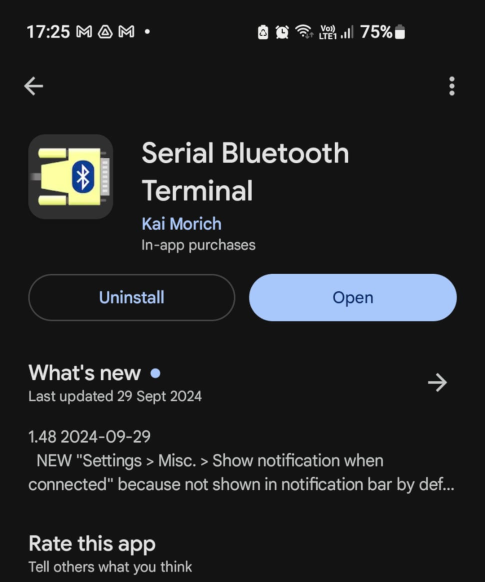
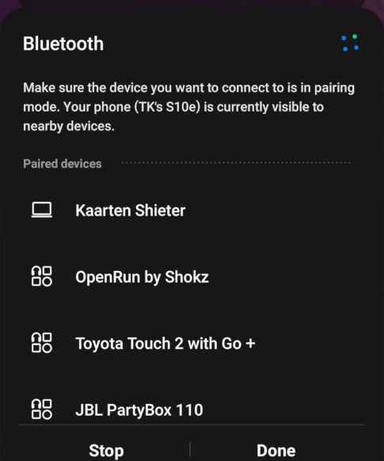
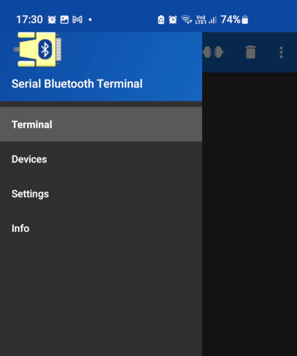
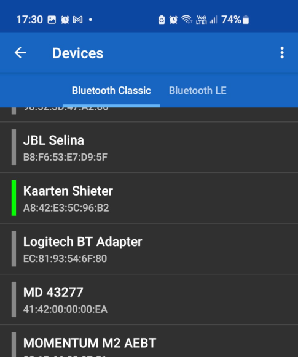
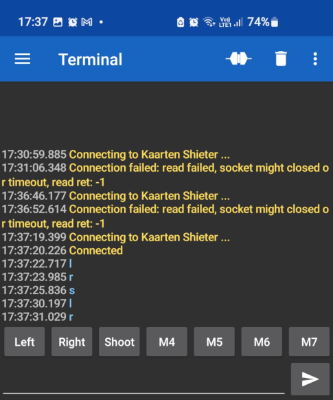
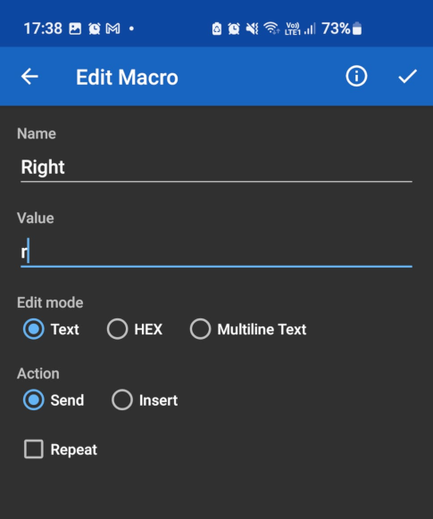

The goal of this product is to make a remote controlled card shooter. It makes use of Bluetooth to receive a set of commands. To operate the the machine use the following guide:
1) Install the "Serial Bluetooth Terminal" on your phone.

2) Turn on the device *(Kaarten Shieter)* and the Bluetooth on your phone.
	- Normally you should see the name "Kaarten Shieter" show up. Pair with it.

3) Click on the hamburger button to open the side tab. Click on the "Devices" tab. Scroll down until you see the "Kaarten Shieter" and click on it.
	- You should be connecting to the device.
	- If you cannot connect to the device, it means that the antenna isn't exposed enough. Remove the lid from the device.

Note: When the device will always wait until at least one master is connected. When the connected has been severed it will start this waiting again. Just repeat steps 3 to reconnect to it.

4) The device accepts three commands:
	- **'l'** (Left): Rotates the device to the left.
	- **'r'** (Right): Rotates the device to the right.
	- **'s'** (Shoot): Starts shooting cards.

Note: The buttons on the bottom can be used to set these commands. By pressing them and holding down.

